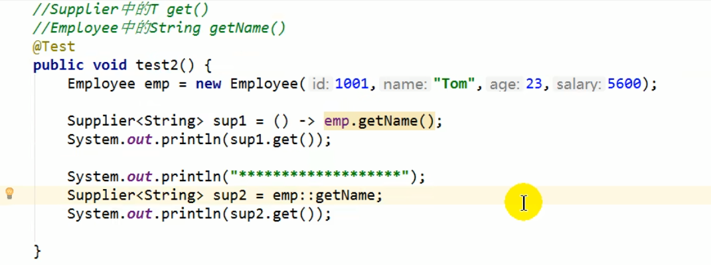
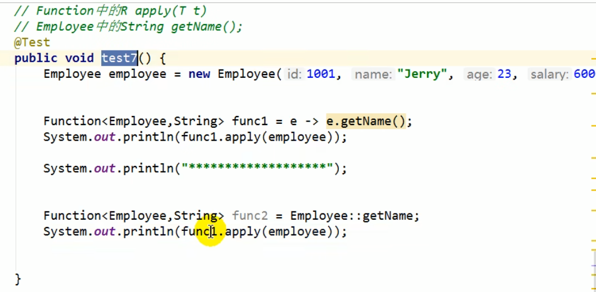
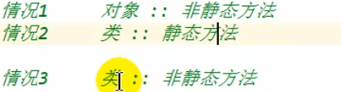
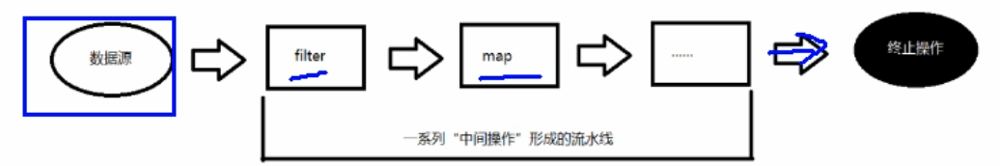

## Java8

是Java开发语言的一个主要版本，它为Java语言、编译器、类库、开发工具和jvm带来了大量新特性

## **lambda表达式的使用**

lambda是一个匿名函数，可以把lambda理解成一段可以传递的代码，用它可以写出更简洁、更灵活的代码

举例：

```java
  @Test
    public void test2(){
        /**
         * 原始写法,接口的匿名实现类
         */
        Comparator<Integer> com1 = new Comparator<Integer>() {
            @Override
            public int compare(Integer o1, Integer o2) {
                return Integer.compare(o1,o2);
            }
        };
        int res1 = com1.compare(21,12);
        System.out.println(res1);

        /**
         * lambda表达式的写法(这里把大括号也省去了)
         */
        Comparator<Integer> com2 = (o1,o2) -> Integer.compare(o1,o2);
        int res2 = com2.compare(21,12);
        System.out.println(res2);

        /**
         * 方法引用
         */
        Comparator<Integer> com3 = Integer :: compare;
        int res3 =com3.compare(21,12);
        System.out.println(res3);
    }

}

```

**本质：**作为**函数式**（只声明了一个抽象方法的）接口的实例

有点坑的语法形式：

lambda表达式若只需要一个参数时，参数的小括号可以省略，lambda表达式需要两个或两个以上的参数，多条执行语句，并且可以有返回值。

```java
@Test
public void test(){
	Comsumer<String> con = s -> System.out.println(s);
    con.accept("lambda表达式若只需要一个参数时，参数的小括号可以省略");
}
@Test
public void test1(){
    Comsumer<String> con1 = (o1,o2) -> {
        System.out.println(o1);
        System.out.println(o2);
        return o1.compareTo(o2);
    };
}
```

 **总结：箭头左边，lambda形参列表的参数类型可以省略（类型推断）；如果参数列表只有一个参数，其小括号（）也可省略；**

​		  **箭头右边：lambda体应该使用一对大括号来包裹；如果只有一条执行语句或只有一句return语句，则可省略大括号以及return关键字。**

## 函数式(Functional)接口

### 定义

​	只声明了一个抽象方法的接口，称为函数式接口

### 用法

​	可以通过lambda表达式来创建该接口的对象。若lambda表达式抛出一个受检异常，那么该异常需要在目标接口的抽象方法上进行声明。

​	可以在一个接口上使用 `@FunctionalInterface`注解，这样IDEA会帮你检查它是不是一个函数式接口。同时，运行javadoc也会包含一条声明，说明这个接口是一个函数式接口。

​	在 java.util.function包下定义了Java8丰富的函数式接口

### 理解

​	Java语言倡导“一切皆对象”，即**面向对象编程**，但是受其它语言的冲击，函数式接口使得Java也可以实现**面向函数编程** OOF

​	lambda表达式是一个函数式接口的实例，也就是说，只要一个对象是函数式接口的实例，那么它就可以用lambda表达式表示出来

​	**之前用匿名实现类表示的现在都可以用lambda表达式来写**

### 示例

```java
/**
 * Java内置四大核心函数式接口
 * 消费型接口 Consumer<T> void accept(T t)
 * 供给型接口 Supplier<T> T get()
 * 函数型接口 Function<T,R> R apply(T t)
 * 断定型接口 Predicate<T> boolean test(T t)
 */
public class LambdaTest2 {
    @Test
    public void test1(){
        happyTime(500,money -> System.out.println("调用了消费型接口"));
    }

    @Test
    public void test2(){
        List<String> list = Arrays.asList("Bob","Boston","boolean");
        //answer1用匿名内部类实现调用接口
        List<String> answer1 = filterString(list, new Predicate<String>() {
            @Override
            public boolean test(String s) {
                return s.contains("B");
            }
        });
        //answer2用lambda表达式来实现调用接口
        List<String> answer2 = filterString(list,The_test -> The_test.contains("b"));
        System.out.println(answer1);
        System.out.println("*********************");
        System.out.println(answer);

    }

    /**
     * 发薪水，用来调用消费性接口
     * @param money
     * @param con
     */
    public void happyTime(double money,Consumer<Double> con){
        con.accept(money);
    }

    /**
     * 根据给定的规则，过滤集合中的字符串。此规则由Predicate接口中的方法决定
     * @param list
     * @param pre 这是Predicate函数式接口的一个实例（可以用lambda表达式来实现重写方法）
     * @return
     */
    public List<String> filterString(List<String> list, Predicate<String> pre){
        ArrayList<String> filterList = new ArrayList<>();
        for(String s:list){
            if(pre.test(s)){
                filterList.add(s);
            }
        }
        return filterList;
    }
}

```

## 方法引用和构造器引用

### 方法引用

使用情境：当要传递给lambda表达式体的操作，已经有方法实现了，可以使用方法引用。

本质：lambda表达式，是一种语法糖。

使用要求（情况一、二）：接口中的抽象方法的形参列表和返回值类型，必须与我们方法引用的方法的形参列表和返回值一致

> 其实就是方法体你要更换成一个现有的！！！想想其中的逻辑

使用格式： `类(对象) :: 方法名 `

#### **情况一**

```java
public class MethodRefTest{
    @Test
    public void test1(){
        //Consumer 的 void accept(T t)
        //PrintStream 的 void println(T t)
        
        //使用lambda表达式，并且表达式体自定义
        Consumer<String> con1 = str -> System.out.println(str);
        con1.accept("Boston");
        
        //使用方法引用(对象::实例方法)
        PrintStream ps = System.out
        Consumer<String> con2 = ps :: println;
        con2.accept("Celtics");
        
    }
}
```


#### **情况二**

对象不能调用静态方法




#### **情况三**

要调用静态方法则用类名





### 构造器引用

> 其实构造器本质上也是一种方法
>
> 在面向对象编程中，构造器（Constructor）是用于创建和初始化对象的特殊方法。它具有以下几个特点：
>
> 1. 方法特征：构造器具有方法的特征，它可以有参数列表、方法体和可能的返回类型（但在构造器中通常没有显式的返回类型）。
> 2. 方法名称：构造器的名称与类名相同，用于标识该构造器属于哪个类。
> 3. 对象创建：构造器在使用 `new` 关键字创建对象时自动调用，用于初始化对象的状态。
> 4. 对象初始化：构造器的主要目的是初始化对象的实例变量和执行必要的设置，以确保对象在创建后处于有效的状态。
> 5. 无返回值：构造器没有显式的返回值，因为它的主要目的是创建对象，而不是返回一个值。
>
> 所以，可以说构造器本质上是一种方法，但它具有一些特殊的特点和用途，用于对象的创建和初始化。

**使用要求：和方法引用类似，函数式接口的抽象方法的形参列表和构造器的形参列表一致。抽象方法的返回值类型即为构造器所属的类的类型**

```java
/**
     * 构造器引用
     * Supplier 中的T get()
     */
    @Test
    public void test1(){
        Supplier<Employee>sup = new Supplier<Employee>() {
            @Override
            public Employee get() {
                return new Employee();
            }
        };

        Supplier<Employee> sup1 = () -> new Employee();
        sup1.get();
        
        //类名::new  即引用了构造器 ::应该就是引用的意思
        Supplier<Employee> sup2 = Employee::new;
        sup2.get();
    }
```

### 数组引用

> 将数组看作一个类的类型

```java
   /**
     * 数组引用
     */
    @Test
    public void test2(){
        Function<Integer,String[]> func1 = len -> new String[len];
        String[] arr1 = func1.apply(5);
        System.out.println(Arrays.toString(arr1));

        //String[]看作一个类型就完了
        Function<Integer,String[]> func2 = String[]::new;
        String [] arr2 = func2.apply(10);
        System.out.println(Arrays.toString(arr2));
    }
}

```


## Stream API

### Stream是什么？

> 真正把**函数式编程风格**带入Java，是对Java类库最好的补充，极大提高Java程序员的生产力
>
> Stream是Java8中处理集合的关键抽象概念，它可以指定你希望对集合进行的操作，可以执行非常复杂的查找、过滤和映射数据等操作。**使用Stream API对集合数据进行操作，就类似于使用SQL执行的数据库查询。**也可以使用Stream API来并行执行操作。简而言之：**Strem API 提供了一种高效且易于使用的数据处理的方式**

Stream和Collection集合的区别：Collection是一种静态的内存数据结构（容器），而Stream是有关计算的。前者主要是面向内存，后者主要是面向CPU，通过CPU进行计算。

> 是数据渠道，用于操作数据源（集合，数组等）所生成的元素序列。
>
> **集合讲的是数据，Stream讲的是计算**

### 一些特点

1. Stream不自己存储数据
2. Stream不会改变源对象，相反，他们会返回一个持有结果的新Stream
3. Stream的操作是延迟的。这意味着他们会等到需要结果的时候再执行

### 操作步骤

测试数据类：

```java
package Java8;

import java.util.ArrayList;
import java.util.List;

/**
 * 提供用于测试的数据
 */
public class EmployeeData {
    //
    public static List<Employee> getEmployees(){
        List<Employee> list = new ArrayList<>();
        list.add(new Employee(1001,"Bob",20,12000));
        list.add(new Employee(1002,"Dominic",20,15648));
        list.add(new Employee(1003,"Cindy",20,15618));
        list.add(new Employee(1004,"George",20,15546));
        return list;
    }
}

```

#### 创建Stream

一个数据源（如：集合、数组），获取一个流

方式有一下几种：

##### 通过集合

```java
/**
 * Stream关注的是对数据的计算，与CPU打交道
 *   集合关注的是数据的存储，与内存打交道
 * 1. Stream不自己存储数据
 * 2. Stream不会改变源对象，相反，他们会返回一个持有结果的新Stream
 * 3. Stream的操作是延迟的。这意味着他们会等到需要结果的时候再执行
 * 执行流程：、
 * 1. Stream的实例化0-=
 * 2. 一系列的中间操作（过滤、映射...）
 * 3. 终止操作
 */
    //通过集合创建Stream
    @Test
    public void test1(){
        List<Employee> employees = EmployeeData.getEmployees();

        //default Stream<E> stream():返回一个顺序流
        Stream<Employee> stream = employees.stream();

        //default Stream<E> parallelStream():返回一个并行流
        Stream<Employee> employeeStream = employees.parallelStream();

    }
```

##### 通过数组

```java
//通过数组创建Stream
    @Test
    public void test2(){
        int[] arr = new int[]{1,2,3,4,5,6};
        //调用Arrays类的静态方法  static <T> Stream<T> stream(T[] array):返回一个数组流
        IntStream stream = Arrays.stream(arr);

        Employee e1 = new Employee(1111,"KK",20,5000);
        Employee e2 = new Employee(1112,"CC",20,5000);
        Employee[] arr1 = new Employee[]{e1,e2};
        Stream<Employee> stream1 = Arrays.stream(arr1);
    }
```

##### 通过调用Stream类的静态方法of()

```java
//通过调用Stream类的静态方法of(),通过显示值创建一个流。它可以接收任意数量的参数
    @Test
    public void test3(){
        //public static<T> Stream<T> of(T values...):返回一个流
        Stream<Double> doubleStream = Stream.of(43.1, 55.2);
    }
```

##### 使用静态方法Stream.iterate()和Stream.generate()

```java
//使用静态方法Stream.iterate()和Stream.generate(),创建无限流
    @Test
    public void test4(){
        //迭代，遍历前10个偶数
        Stream.iterate(0,t -> t+2).limit(10).forEach(System.out::println);

    }
```


#### 中间操作

一个中间操作链，对数据源的数据进行处理

> Stream的中间操作可以连接起来形成一个流水线，**除非流水线上触发终止操作，否则中间操作不会执行任何处理！**而在终止操作时一次性全部处理，称为“**惰性求值**”

##### 筛选和切片

```java
/**
 * 测试Stream的中间操作
 *
 */
public class StreamAPITest1 {
    //筛选与切片
    @Test
    public void test1(){
        List<Employee> list = EmployeeData.getEmployees();
        Stream<Employee> stream = list.stream();

        //filter(Predicate p)--接收lambda，从中排除某些元素
        //查询员工表中薪资大于15000的员工姓名和实际薪水
        stream.filter(e -> e.getSalary()>=15000).forEach(e -> System.out.println(e.getName()+" "+e.getSalary()));

        //limit(n)--截断流，使其元素不超过n
        list.stream().limit(2).forEach(System.out::println);

        //skip(n)--跳过元素，返回一个扔掉了前n个元素的stream若stream中的元素不足n个，则返回一个
        list.stream().skip(2).forEach(System.out::println);

        System.out.println();
        //distinct()--筛选，通过流所生成元素的hashCode()和equals()去除重复元素
        list.add(new Employee(1009,"Crack",22,13000));
        list.add(new Employee(1009,"Crack",22,13000));
        list.add(new Employee(1009,"Crack",22,13000));
        list.add(new Employee(1009,"Crack",22,13000));

        list.stream().distinct().forEach(System.out::println);
    }
}
```

#####   映射

```java
    //映射
    @Test
    public void test2(){
        //map(Function f)--接收一个函数作为参数，将元素转换成其它形式或提取信息，该函数会被应用到每一个元素上去，并将其映射成一个新的元素
        List<String> list = Arrays.asList("boston", "celtics");
        list.stream().map(String::toUpperCase).forEach(System.out::println);

        System.out.println();
        //练习：获取长度大于三的员工姓名
        List<Employee> employees = EmployeeData.getEmployees();
        Stream<String> nameStream = employees.stream().map(Employee::getName);
        nameStream.filter(n->n.length()>3).forEach(System.out::println);

        System.out.println();
        //练习：
        Stream<Stream<Character>> streamStream = list.stream().map(StreamAPITest1::fromStringToStream);
        streamStream.forEach(s->{
            s.map(Character::toUpperCase).forEach(System.out::println);
        });
        System.out.println();
        //flatMap(Function f)--接收一个函数作为参数，将流中的每个值都换成另一个流，然后把所有的流连接成一个流
        Stream<Character> characterStream = list.stream().flatMap(StreamAPITest1::fromStringToStream);
        characterStream.map(Character::toUpperCase).forEach(System.out::println);
    }

    //将字符串中的多个字符构成的集合转换成对应单Stream的实例
    public static Stream<Character> fromStringToStream(String str){
        ArrayList<Character> list = new ArrayList<>();
        for(Character c:str.toCharArray()){
            list.add(c);
        }
        return list.stream();
    }
}

```

##### 排序

```java
//排序
    @Test
    public void test3(){
        //sorted() 自然排序
        List<Integer> list = Arrays.asList(12, 44, 89, 21, 34, 0, -2, 11);
        list.stream().sorted().forEach(System.out::println);

        /*
        List<Employee> employees = EmployeeData.getEmployees();
        employees.stream().sorted().forEach(System.out::println);
        抛异常，Employee类没有实现Comparable接口
        */
        //sorted(Comparator com) 定制排序
        List<Employee> employees = EmployeeData.getEmployees();
        employees.stream().sorted((e1,e2) -> {
            int ageValue = Integer.compare(e1.getAge(),e2.getAge());
            if(ageValue != 0){
                return ageValue;
            }else {
                return Double.compare(e1.getSalary(),e2.getSalary());
            }
        }).forEach(System.out::println);
    }
```


#### 终止操作

一旦执行终止操作，就执行中间操作链，并产生结果。之后，不会再被使用。



> 终端操作会从流的流水线生成结果。其结果可以是不是任何流的值，例如：List，Integer，甚至是void
>
> 流进行了终止操作后，不能再次使用

##### 匹配与查找

```java
package Java8.TheStreamAPI;

import Java8.Employee;
import Java8.EmployeeData;
import org.junit.Test;

import java.util.List;
import java.util.Optional;
import java.util.stream.Stream;

/**
 * 测试Stream的终止操作
 */
public class StreamAPITest2 {
    //1-匹配与查找
    @Test
    public void test1(){
        List<Employee> employees = EmployeeData.getEmployees();

        //allMatch(Predicate p)--检查是否匹配所有元素。
        //练习：是否所有员工的年龄都大于18
        boolean allMatch = employees.stream().allMatch(e -> e.getAge() > 18);
        System.out.println(allMatch);

        //anyMatch(Predicate p)--检查是否至少匹配一个元素
        boolean anyMatch = employees.stream().anyMatch(e -> e.getSalary() < 10000);
        
        //noneMatch(Predicate p)--检查是否没有匹配的元素
        boolean noneMatch = employees.stream().noneMatch(e -> e.getAge() == 22);
        
        //findFirst--返回第一个元素
        Optional<Employee> first = employees.stream().findFirst();
        
        //findAny--返回当前流的任意元素
        Optional<Employee> any = employees.parallelStream().findAny();
        
        //count--返回流中元素的总个数
        long count = employees.stream().count();
        
        //max(Comparator c)--返回流中最大值
        Stream<Integer> salaryStream = employees.stream().map(Employee::getSalary);
        Optional<Integer> maxSalary = salaryStream.max((Integer::compare));

        //min(Comparator c)--返回流中最小值
        Optional<Employee> minSalary = employees.stream().min((e1, e2)->Integer.compare(e1.getSalary(),e2.getSalary()));
        System.out.println(minSalary);

        //forEach(Consumer c)--内部迭代
        employees.stream().forEach(System.out::println);

    }
}

```

##### 规约

```java
 //2-规约
    @Test
    public void test2(){
        //reduce (T identity,BinaryOperator)--可以将流中的元素反复结合起来，得到一个值，返回一个T
        //计算1-10的自然数的和
        List<Integer> list = Arrays.asList(1, 2, 3, 4, 5, 6, 7, 8, 9, 10);
        Integer sum = list.stream().reduce(0, Integer::sum); //identity 是初始值，后面用方法引用（Integer的sum方法两个参数返回一个同样类型的对象，与reduce的一致）
        System.out.println(sum);

        //reduce(BinaryOperator)--可以将流中的元素反复结合起来，得到一个值，返回Optional<T>
        //计算公司所有员工工资的总和
        List<Employee> employees = EmployeeData.getEmployees();
        Optional<Integer> sumSalary = employees.stream().map(Employee::getSalary).reduce((d1,d2)->d1+d2);
        System.out.println(sumSalary);
    }
```

#####  收集

```java
//3-收集
    @Test
    public void test3(){
        //collect(Collector c)--将流转化为其他形式。接受一个Collector接口的实现，用于给
        //查找工资大于14000的员工，返回一个List或Set
        List<Employee> employees = EmployeeData.getEmployees();
        //List
        List<Employee> employeeList = employees.stream().filter(e -> e.getSalary() > 14000).collect(Collectors.toList());
        employeeList.forEach(System.out::println);

        System.out.println();

        //Set
        Set<Employee> employeeSet = employees.stream().filter(e -> e.getSalary() > 14000).collect(Collectors.toSet());
        employeeList.forEach(System.out::println);
    }
```

## Optional类

> 到目前为止，空指针异常是导致Java应用程序失败的最常见原因，为了解决空指针异常，Goggle公司的Guava项目引入了Optional类，Guava通过使用检查空值的办法来防止代码污染，受到Goggle Guava的启发，Optional类已经成为Java 8类库的一部分

### 概述

Optional<T>类是一个容器类，它可以保存类型T的值，代表这个值存在。或仅仅保存null，表示这个值不存在。**Optional可以避免空指针异常**

> javadoc描述：**这是一个可以为null的容器对象。如果值不存在则isPresent()方法会返回true，调用get()方法会返回该对象**

### 提供的重要方法

#### 创建Optional类对象

`Optional.of(T t)`：创建一个Optional实例，t必须非空

```java
 @Test
    public void test1(){
        Girl girl = new Girl();
        Optional<Girl> girl1 = Optional.of(girl);
    }
```

`Optional.empty()`：创建一个空的Optional实例


`Optional.ofNullable(T t)`：t可以为null

```java
@Test
    public void test2(){
        Girl girl = new Girl();
        girl =null;
        Optional<Girl> optionalGirl = Optional.ofNullable(girl);
        System.out.println(optionalGirl);
    }
```


#### 判断Optional容器中是否包含对象

`boolean isPresent()`


`void ifPresent(Comsumer<?super T> consumer)`：如果有值，就执行Consumer接口的实现代码，并且该值会作为参数传递给它

#### 获取Optional容器的对象

`T get()`：如果调用对象包含值，返回该值，否则抛出异常

`T orElse(T other)`：如果有值则将其返回，否则返回指定的other对象

`T orElseGet(Supplier<? extends T> other)`：如果有值则将其返回，否则返回由Supplier接口实现提供的对象

`T orElseThrow(Supplier<? extends X> exceptionSupplier)`:如果由值则将其返回，否则抛出由Supplier接口实现提供的异常

### Optional类的的作用案例

现在有两个类，Boy类和Girl类

```java
package Java8.TheOptional;

public class Boy {
    private Girl girl;

    @Override
    public String toString() {
        return "Boy{" +
                "girl=" + girl +
                '}';
    }

    public Girl getGirl() {
        return girl;
    }

    public void setGirl(Girl girl) {
        this.girl = girl;
    }

    public Boy() {
        this.girl = girl;
    }
}

```

```java
package Java8.TheOptional;

public class Girl {
    private String name;

    @Override
    public String toString() {
        return "Girl{" +
                "name='" + name + '\'' +
                '}';
    }

    public Girl() {
        this.name = name;
    }

    public String getName() {
        return name;
    }

    public void setName(String name) {
        this.name = name;
    }
}

```

可以看到，Girl类有私有变量name，而Boy类则是将一个Girl实例当作私有变量

现在想要写一个方法，getGirlName()来获取Girl对象的name属性

```java
public String getGirlName(Boy boy){
        return boy.getGirl().getName();
    }
```

来看下面这段测试代码：

```java
//报空指针异常，没有实例Girl
    @Test
    public void test3(){
        Boy boy = new Boy();
        String  girlName = getGirlName(boy);
        System.out.println(girlName);
    }
```

这样运行下来报了空指针异常，原因是在调用getGril()时并没有实例化一个Girl对象，Boy类的构造函数里没有初始化。

现在来对方法进行优化：

```java
//优化方法，增加判定条件
    public String getGirlName1(Boy boy){
        if(boy != null){
            Girl girl = boy.getGirl();
            if(girl != null)
                return girl.getName();
        }
        return null;
    }
```

有if语句的判断，能返回出null，而不会产生空指针异常

同样用上面的特殊test3()测试代码来测，可以通过。

**上面这么多工作，都需要我们人为去判定避免空指针，接下来看Optional类可以带来什么作用**

```java
//使用Optional类的优化方法
    public String getGirlName2(Boy boy){
        //将boy包装到Optional容器里
        Optional<Boy> boyOptional = Optional.ofNullable(boy);

        //orElse方法可以在boy1为空的时候默认返回参数设定的值，避免了空指针
        Boy boy1 = boyOptional.orElse(new Boy(new Girl("迪丽热巴")));

        Girl girl = boy1.getGirl();

        //避免girl为空，用ofNullable
        Optional<Girl> girlOptional = Optional.ofNullable(girl);

        //此时的girl1一定非空，这里也用了orElse
        Girl girl1 = girlOptional.orElse(new Girl("古力娜扎"));

        //最后一定可以成功返回一个name值，因为girl1不可能为空了
        return girl1.getName();
    }
```

测试：

```java
public void test5(){
        Boy boy = null;
        String girlName2 = getGirlName2(boy);
        System.out.println(girlName2);
    }
```

成功输出迪丽热巴，因为方法里的orElse保证了一个默认的boy实例

测试：

```java
  @Test
    public void test6(){
        Boy boy= new Boy();
        String girlName2 = getGirlName2(boy);
        System.out.println(girlName2);
    }
```

成功输出古力娜扎，因为方法里的orElse保证了一个默认的Girl实例

